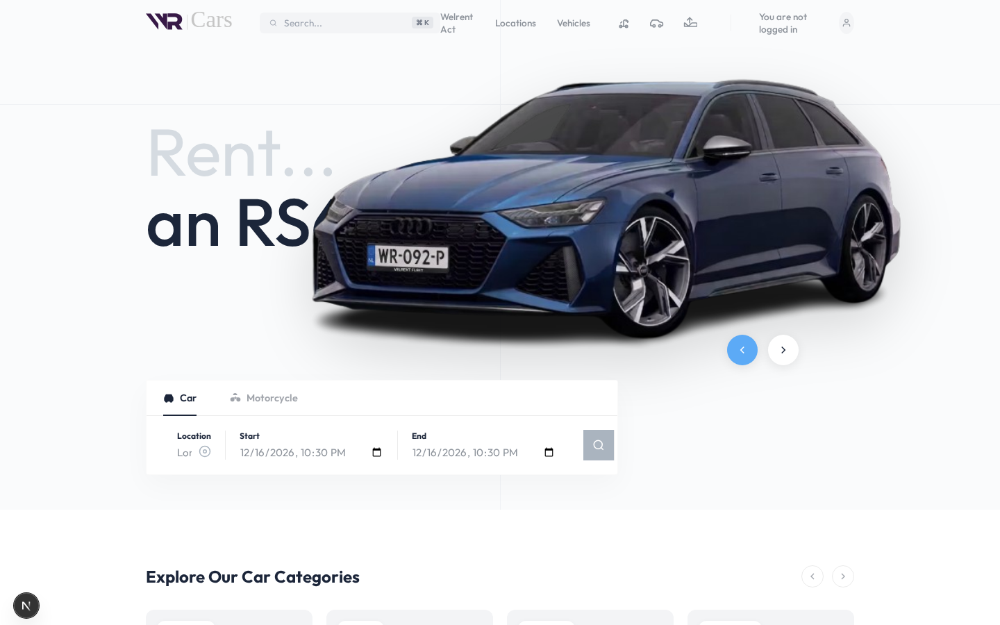
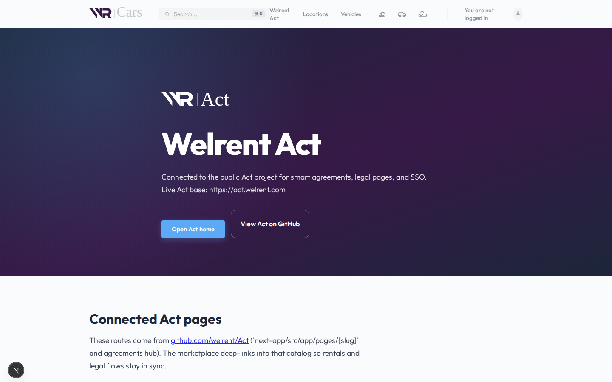
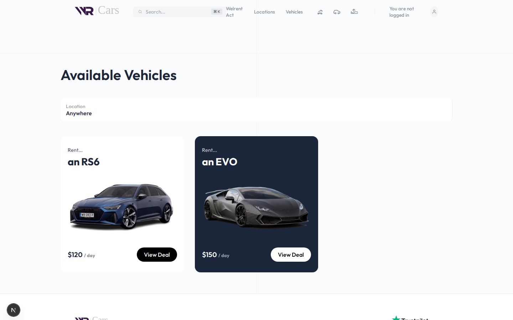
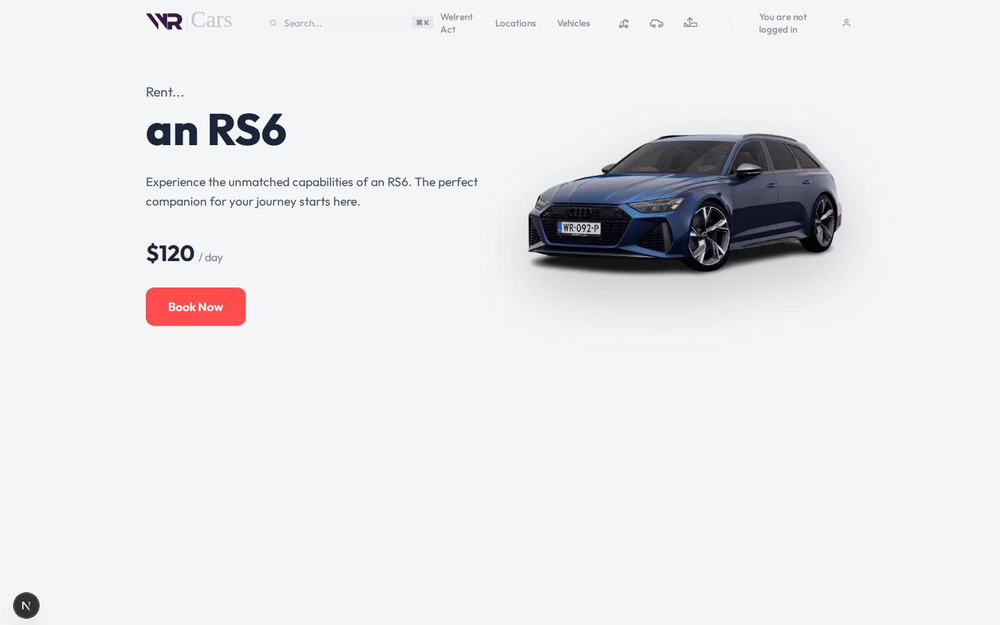
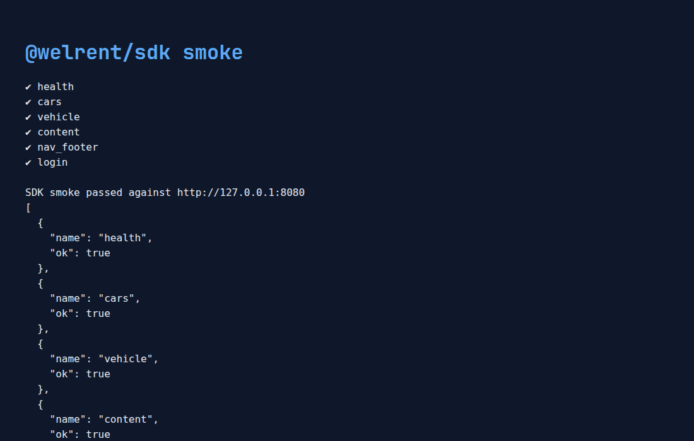
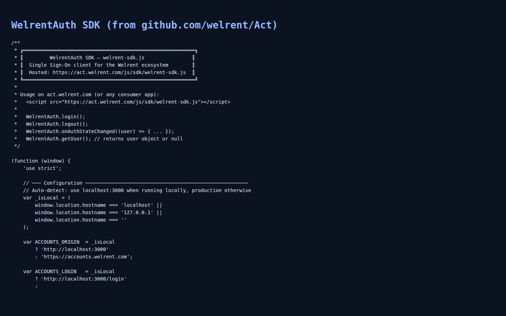

# Welrent Frontend (public proof)

Public repository: **[github.com/welrent/wr-frontend](https://github.com/welrent/wr-frontend)**  
Act repository: **[github.com/welrent/Act](https://github.com/welrent/Act)** (public)  
Visibility verified: **PUBLIC** (`gh api repos/welrent/wr-frontend` / `welrent/Act` → `"visibility":"public"`).

Welrent is a car / motorcycle / boat rental platform with:

- **Next.js web app** (`next-web/`) — marketplace UI + Act bridge page
- **PHP JSON API** (`index.php`, `api/`, `lib/`) — cars, auth, content, rentals
- **JavaScript SDK** (`sdk/`) — `@welrent/sdk` API client + vendored `WelrentAuth` from Act
- **Flutter mobile scaffold** (`flutter-app/`) — consumes the same API
- **Welrent Act** — smart agreements / legal pages from [`welrent/Act`](https://github.com/welrent/Act)

## Demo proof

Screenshots and walkthrough video captured from a local run of the public codebase:

| Asset | Description |
| --- | --- |
|  | Home hero + search |
|  | Welrent Act bridge connected to github.com/welrent/Act |
|  | Vehicles from API / demo fallback |
|  | Vehicle detail (`/vehicle/an-RS6`) |
|  | `@welrent/sdk` smoke test against PHP API |
|  | Vendored `WelrentAuth` SDK from Act |
| Video | [`docs/proof/welrent-walkthrough.mp4`](docs/proof/welrent-walkthrough.mp4) |

## Quick start

### 1. PHP API

```bash
php -S 127.0.0.1:8080 index.php
```

Health check: `curl http://127.0.0.1:8080/` → `{"status":"success","message":"Welrent API is running"}`

### 2. Next.js web

```bash
cd next-web
cp .env.example .env.local   # set NEXT_PUBLIC_API_BASE_URL=http://127.0.0.1:8080
npm install
npm run dev
```

Open [http://localhost:3000](http://localhost:3000).

Key routes:

- `/` home
- `/act` Welrent Act (also linked from header + footer)
- `/offerlist` vehicles
- `/vehicle/[slug]` detail
- `/locations`, `/login`, `/privacy`, `/terms`

### 3. JavaScript SDK

```bash
cd sdk
node --test test/sdk.test.js
WELRENT_API_BASE=http://127.0.0.1:8080 node scripts/smoke.mjs
```

Example:

```js
import { WelrentClient } from './sdk/src/index.js';

const client = new WelrentClient({ baseUrl: 'http://127.0.0.1:8080' });
const cars = await client.getCars();
const session = await client.login({ email: 'demo@welrent.com', password: 'demo-pass' });
```

### 4. Flutter app

```bash
cd flutter-app
# requires Flutter SDK
flutter pub get
flutter run
```

`lib/api_service.dart` talks to `/api/cars` and `/api/auth/login`.

## Architecture

```text
Flutter App  ──┐
Next.js Web  ──┼──►  PHP JSON API  ──►  MySQL (optional; demo data if offline)
JS SDK       ──┘
```

When MySQL is unavailable the API serves demo cars/content so the web app and SDK keep working.

## Welrent Act connection

Connected to the public Act project: **https://github.com/welrent/Act**

- Marketplace bridge page: `/act`
- Act deployment base: `NEXT_PUBLIC_ACT_BASE_URL` (default `https://act.welrent.com`)
- Deep links: `/pages/car-rental-agreement`, `/pages/boat-rental-agreement`, `/pages/equipment-rental-agreement`, `/pages/terms`, `/pages/privacy`, `/pages/cookie`, `/pages/accessibility`, `/agreements`
- SSO SDK vendored from Act: `next-web/public/js/sdk/welrent-sdk.js` (also `sdk/welrent-auth.js`)
- Notes: [`docs/act/README.md`](docs/act/README.md)

`act.welrent.com` may not resolve in every environment yet; the `/act` hub still lists every Act page path and the public GitHub source.

## Public proof checklist

- [x] Repository is **public** on GitHub
- [x] Web app routes respond `200`
- [x] PHP API health + cars + login work
- [x] SDK unit tests + live smoke pass
- [x] Act pages linked through nav/footer
- [x] Screenshots + walkthrough video in `docs/proof/`

## License

ISC / project default. Brand assets in `assets/` and `next-web/public/assets/` remain Welrent property.
