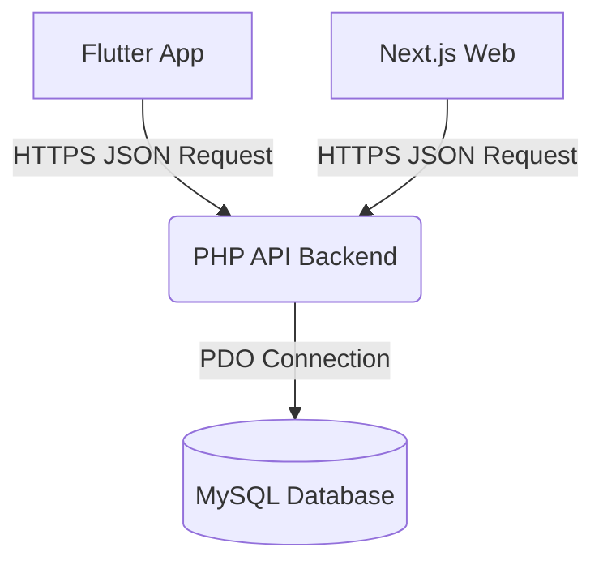

# Full-Stack Architecture Overhaul: Next.js + Flutter + PHP API

This plan outlines the complete architectural transformation of the Welrent platform from a monolithic PHP application into a decoupled system using a central PHP API, a Next.js web frontend, and a Flutter mobile app.

## User Review Required
> [!IMPORTANT]
> - **Flutter Availability:** Do you have the Flutter SDK installed on your macOS system in a path accessible via CLI? If not, I can write the core Dart implementation files manually, but I cannot compile/run it without the SDK.
> - **Directory Structure:** I propose placing the new applications next to `htdocs` or within it like this:
>   - `/Applications/XAMPP/xamppfiles/htdocs/api/` (Core PHP backend)
>   - `/Applications/XAMPP/xamppfiles/htdocs/next-web/` (Next.js Application)
>   - `/Applications/XAMPP/xamppfiles/htdocs/flutter-app/` (Flutter Application)
>   Is this path acceptable to you, or would you prefer them outside of the XAMPP directory entirely?
> - **Prioritization:** Since this is a massive undertaking, I recommend splitting this into phases. Phase 1 will be converting the PHP backend and building the Next.js replica of our current UI. Phase 2 will involve authentication/Stripe integration, and Phase 3 will be Flutter. Does this phased approach work for you?

## Objective: The Decentralized Architecture

## Proposed Changes: Phase 1 (API & Next.js Core)

### 1. PHP API Refactoring
We will strip PHP of all HTML responsibilities, transforming it strictly into a JSON API provider.

#### [MODIFY] [index.php](file:///Applications/XAMPP/xamppfiles/htdocs/index.php)
- Implement global CORS headers (Access-Control-Allow-Origin, headers, methods) to allow Next.js and Flutter to communicate seamlessly with XAMPP.
- Redirect all existing HTML route definitions (`/offerlist`, `/checkout`) to return JSON endpoints representing their respective data grids rather than view files.

#### [NEW] [api/auth.php](file:///Applications/XAMPP/xamppfiles/htdocs/api/auth.php)
- Base logic for JWT (JSON Web Token) generation and verification for cross-platform login without session cookies. 

### 2. Next.js Web Deployment
We will recreate the stunning Welrent UI currently housed in `.php` views over to robust React Components in Next.js.

- Run `npx create-next-app@latest next-web` non-interactively.
- Migrate `assets/` and `index.css` directly into the Next.js `public/` and `app/globals.css` directories framework.
- Create `/app/page.tsx` (Homepage mirroring `home.php`)
- Create `/app/offerlist/page.tsx`
- Create `/app/vehicle/[slug]/page.tsx`
- Develop API fetch hooks pointing to `http://localhost/api/...`.

## Proposed Changes: Phase 2 & 3 (Flutter & Secure Systems)

### 3. Flutter Application Initialization
- Run `flutter create welrent_mobile`.
- Integrate the `http` package for backend data.
- Clone the Next.js design semantics into Flutter Widgets (`OfferListScreen`, `VehicleDetailScreen`).

### 4. Stripe & Advanced Features
- Create PHP backend webhook receivers and secure PaymentIntent generators.
- Create Flutter `flutter_stripe` components and Next.js Stripe Elements for checkout.
- Establish file upload endpoints matching the `lib/db.php` standards for user documentation logic.

## Open Questions
- Do you already have a Stripe API key and JWT secret you want me to utilize, or should I generate mock configurations?
- Should we stick with Vanilla CSS in Next.js since we just developed a highly custom `index.css`, or do you want to transition it to Tailwind CSS entirely?

## Verification Plan
1. Send `curl` OPTION requests to verify CORS validation on PHP backend.
2. Launch `npm run dev` in Next.js and browse through all URLs to confirm the React layout successfully mirrors the legacy PHP UI.
3. Validate JSON payload matching algorithms between Database and Front-ends.
